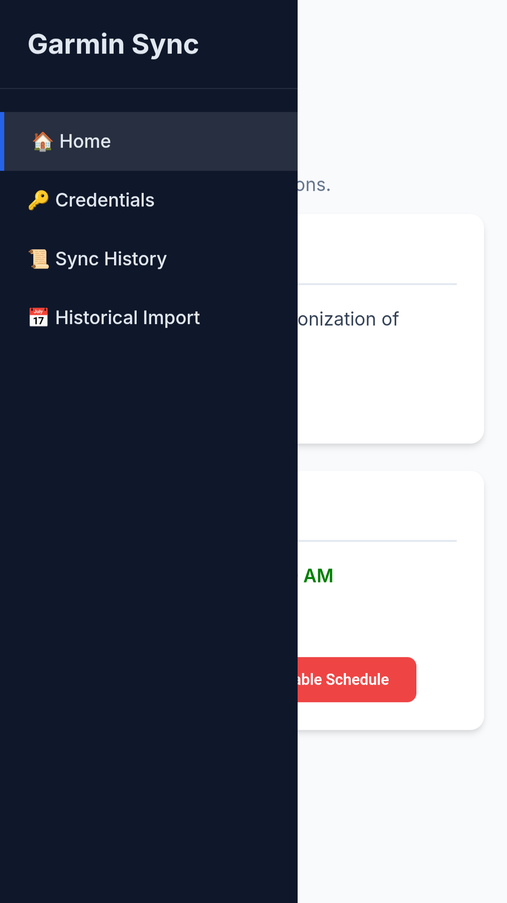
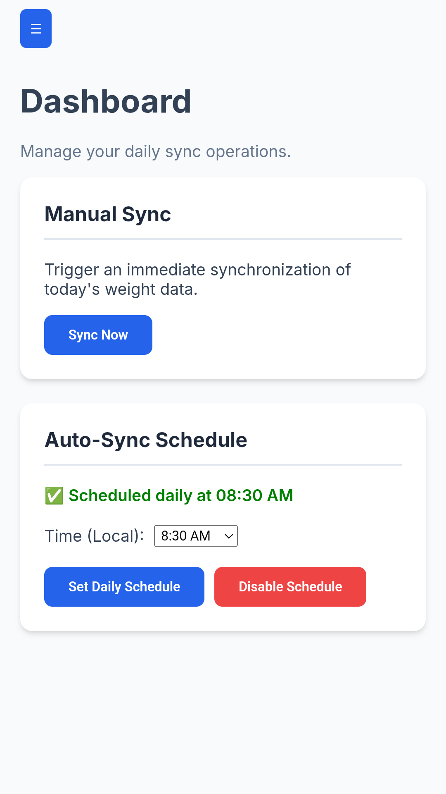
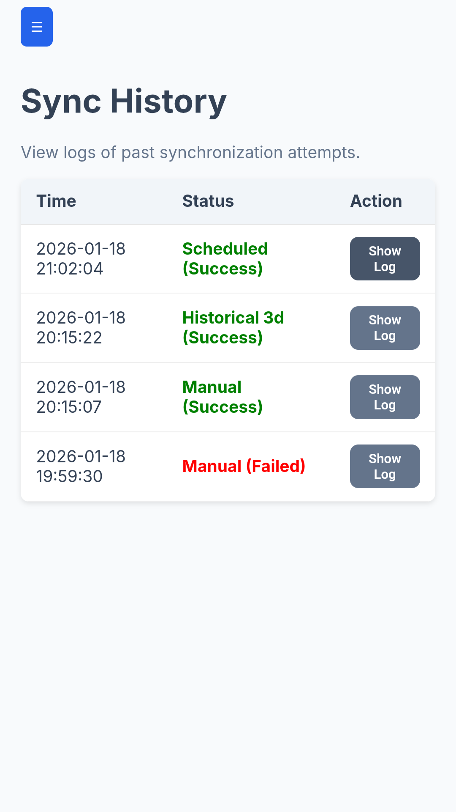
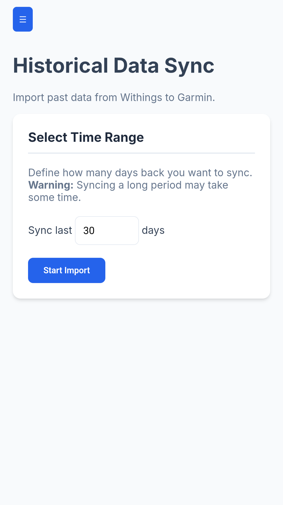

# Grrmin Sync - Sync Withings to Garmin Connect

> [!CAUTION]
> **Disclaimer**: This web app is meant to run privately in your home network. Please use it at your own risk.

A simple tool to sync body composition data (Weight, Fat %, Muscle Mass, etc.) from Withings to Garmin Connect.

<p align="center">
  
  
  
  
  
</p>

## Prerequisites

- **Docker** (or Docker Desktop) installed and running.
- A **Garmin Connect** account.
- A **Withings** account.

## Getting Started

### 1. Create `docker-compose.yml`

Create a file named `docker-compose.yml` in a new folder and paste the following content:

```yaml
services:
  grrmin-sync:
    image: ghcr.io/kilooo/grrminsync:latest
    container_name: grrmin-sync
    ports:
      - "5000:5000"
    volumes:
      # /app/data contains: 
      # 1. grrmin_import.db (Sync History)
      # 2. credentials.json (Your Keys)
      # 3. withings_tokens.pkl (Session Tokens)
      - ./data:/app/data
    environment:
      # OPTIONAL: You can set these if you prefer env vars over the Web UI.
      # If not set, the app will use the values you save in the Web UI.
      - WITHINGS_CLIENT_ID
      - WITHINGS_CLIENT_SECRET
      - WITHINGS_REDIRECT_URI
      - GARMIN_EMAIL
      - GARMIN_PASSWORD
    restart: unless-stopped
```

### 2. Start the Application

Open a terminal in the folder where you created the file and run:

```bash
docker-compose up -d
```

### 3. Open the Web Interface

Go to **http://<YOUR_SERVER_IP>:5000** in your web browser.

---

## Configuration

You will need to configure your credentials in the Web UI.

### Step 1: Get Withings Credentials

1.  Go to the [Withings Developer Portal](https://developer.withings.com/dashboard/).
2.  Log in with your Withings account.
3.  Click **Add an app**.
4.  Fill in the details:
    -   **App Name**: `Grrmin Sync` (or any name you prefer)
    -   **Description**: `Sync body composition data to Garmin Connect`
    -   **Contact Email**: Your email
    -   **Callback URL**: `http://localhost:5000/auth/withings/callback`
        > **Important**: If you are hosting this on a different server (not localhost), replace `localhost` with your server's IP address or domain name.
5.  Click **Done**.
6.  You will now see your **Client ID** and **Consumer Secret** (Client Secret). Keep this page open.

### Step 2: Configure the App

1.  In the Web UI (http://<YOUR_SERVER_IP>:5000), click on **Credentials**.
2.  **Garmin Configuration**:
    -   Enter your Garmin Connect email and password.
    -   Click **Save Credentials**.
3.  **Withings Configuration**:
    -   Copy the **Client ID** and **Secret ID** from the Withings portal and paste them into the corresponding fields.
    -   Click **Save Credentials**.

### Step 3: Complete Setup

1.  If you haven't already, ensure you clicked **Connect Withings** after saving your credentials.
2.  You will be redirected to Withings to approve the app. Click **Allow**.
3.  You will be redirected back to the app with a success message.

## Usage

-   **Sync Now**: On the Home page, click **Sync Now** to immediately check for the latest measurement and upload it to Garmin.
-   **Schedule**: Set a daily time for the app to automatically check for new weight readings.
-   **History**: View logs of past sync attempts.
-   **Historical Sync**: If you have past data you want to import, use the "Historical Import" page to sync data from the last 30+ days.

## Troubleshooting

-   **Redirect URL Mismatch**: If you get an error during Withings login, ensure the "Callback URL" in your Withings Developer App matches exactly with the URL in your browser address bar + `/auth/withings/callback`.
-   **Logs**: Check the container logs for errors:
    ```bash
    docker-compose logs -f
    ```

## License

This project is licensed under the MIT License - see the [LICENSE](LICENSE) file for details.
