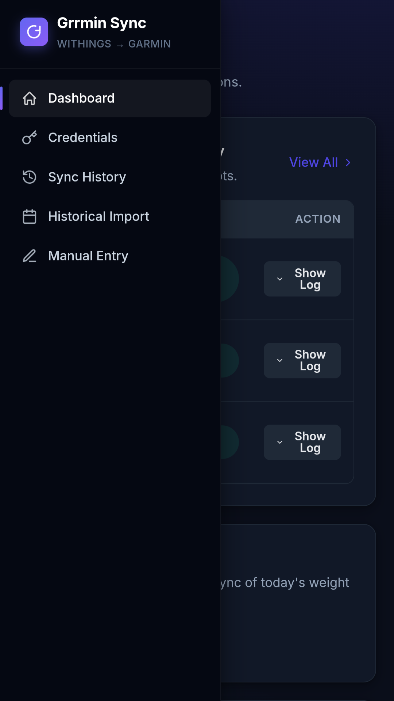
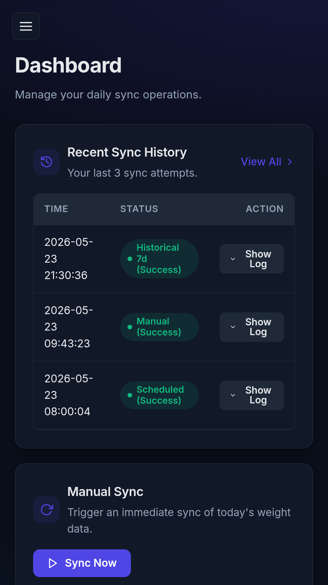
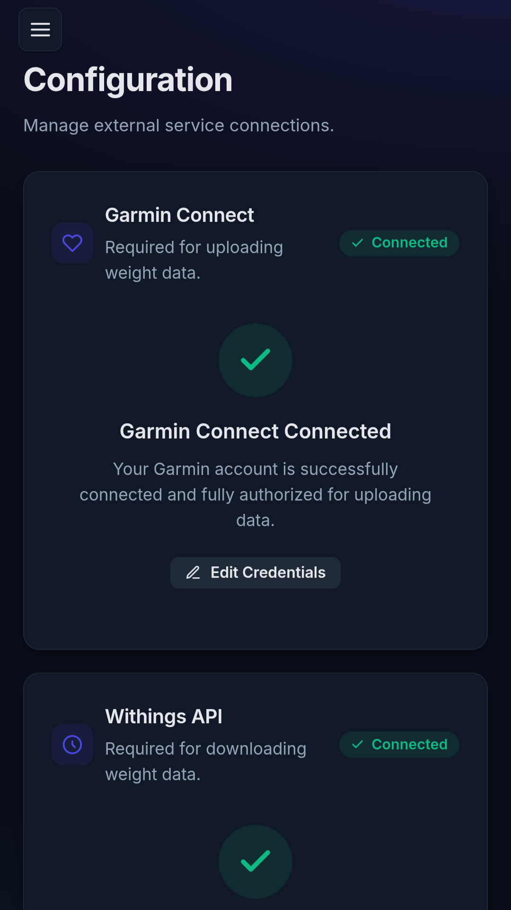
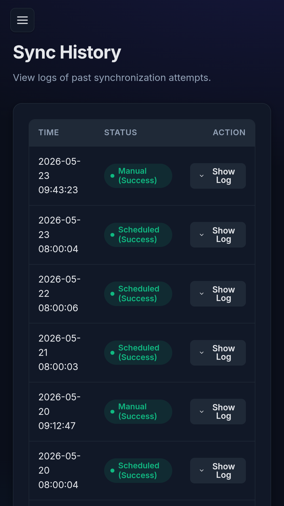
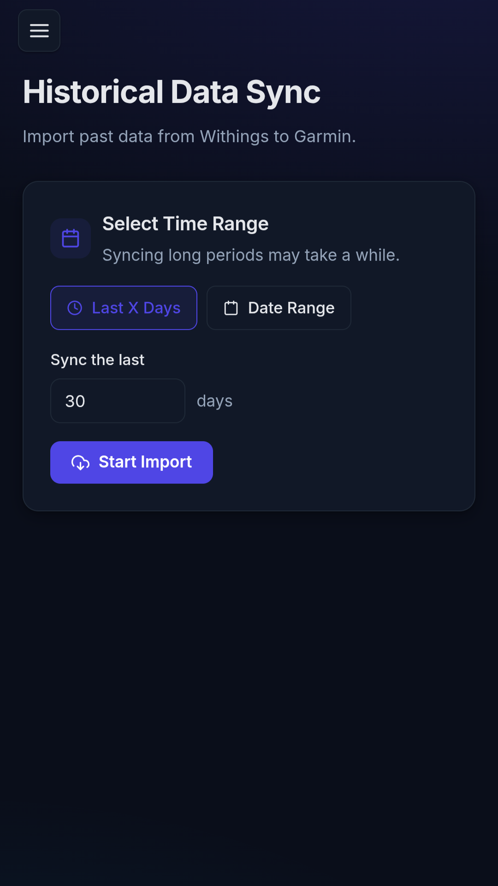

# Grrmin Sync - Sync Withings & Xiaomi S400 to Garmin Connect

A simple, self-hosted tool to sync body composition data (Weight, Fat %, Muscle Mass, Water %, Bone Mass, Visceral Fat, BMI) and blood pressure data from **Withings** or **Xiaomi Body Composition Scale S400 (Bluetooth)** to **Garmin Connect**.

<p align="center">
  
  
  
  
  
</p>

## Features

- **Withings Cloud Sync**: Automatically pulls measurements via Withings REST API and uploads to Garmin Connect.
- **Xiaomi S400 Scale (BLE) Direct Sync**: Real-time background Bluetooth listener that connects when you step on the scale, streams live weight, calculates full dual-impedance body composition metrics, and uploads directly to Garmin Connect.
- **Multi-User Protection Filter**: Set a target weight window (e.g. 75 kg ± 5 kg) so shared family scales only upload your personal weigh-ins.
- **Web UI Management**: Configure credentials, toggle background listeners, set automated daily sync schedules, view sync history, and run manual uploads.

---

## Prerequisites

- **Docker** (or Docker Desktop) installed and running, or native Python 3.10+.
- A **Garmin Connect** account.
- A **Withings** account (if using Withings) and/or a **Xiaomi Body Composition Scale S400** with Bluetooth on your host (e.g. Raspberry Pi or Linux server).

---

## Getting Started

### 1. Create `docker-compose.yml`

Create a file named `docker-compose.yml` in a new folder and paste the following content:

```yaml
services:
  grrmin-sync:
    image: ghcr.io/kilooo/grrminsync:latest
    container_name: grrmin-sync
    ports:
      - "5000:5000"
    # For Raspberry Pi / Linux Bluetooth scale support, uncomment network_mode & privileged:
    # network_mode: host
    # privileged: true
    volumes:
      # /app/data contains: 
      # 1. garmin_import.db (Sync History)
      # 2. credentials.json (Your Keys)
      # 3. withings_tokens.pkl (Session Tokens)
      - ./data:/app/data
      # OPTIONAL: Mount host D-Bus for Xiaomi BLE scale syncing on Linux/Raspberry Pi:
      # - /var/run/dbus:/var/run/dbus:ro
    environment:
      # Set your local Timezone e.g. Europe/Berlin
      - TZ=Europe/Berlin
      # OPTIONAL: You can set these if you prefer env vars over the Web UI.
      # If not set, the app will use the values you save in the Web UI.
      - WITHINGS_CLIENT_ID
      - WITHINGS_CLIENT_SECRET
      - WITHINGS_REDIRECT_URI
      - WITHINGS_ENABLED
      - GARMIN_EMAIL
      - GARMIN_PASSWORD
      - XIAOMI_MAC
      - XIAOMI_BINDKEY
      - XIAOMI_TOKEN
      - XIAOMI_ENABLED
    restart: unless-stopped
```

### 2. Start the Application

Open a terminal in the folder where you created the file and run:

```bash
docker-compose up -d
```

### 3. Open the Web Interface

Go to **http://&lt;YOUR_SERVER_IP&gt;:5000** in your web browser. Default password is `admin`.

---

## Configuration

In the Web UI, go to **Credentials** to connect your services.

### 1. Garmin Connect Configuration
* Enter your Garmin Connect **Email** and **Password**.
* Click **Save & Connect** (enter MFA code if prompted).

---

### 2. Xiaomi Scale S400 Setup (Bluetooth)

The Xiaomi S400 communicates over encrypted Bluetooth Low Energy (Mi Home v2 protocol). To connect, you will need the scale's encryption keys.

#### Step A: Extract Scale Credentials (`MAC`, `BindKey`, `Token`)
1. Ensure the scale is paired in the **Xiaomi Home / Mi Home** mobile app.
2. Run the open-source [Xiaomi Cloud Tokens Extractor](https://github.com/PiotrMachowski/Xiaomi-cloud-tokens-extractor) on your computer (or have the scale owner run it if you share the scale).
3. The extractor will output:
   * **MAC Address** (e.g. `CC:4D:75:D6:45:0D`)
   * **BindKey** (32-character hex key)
   * **Token** (24-character hex token)

#### Step B: Configure in GrrminSync
1. In the Web UI under **Credentials**, scroll to **Xiaomi Body Composition Scale S400 (BLE)**.
2. Toggle **Enable Xiaomi BLE Background Listener** to **ON**.
3. Paste the **Scale MAC Address**, **BindKey**, and **Token**.
4. Set your **User Profile** (Sex, Age, Height) for accurate body impedance calculations.
5. Set your **Target Weight (kg)** and **Tolerance (± kg)** (e.g. `75.0 kg ± 5.0 kg`).
   > **Note on Shared Scales**: If other people use the scale, weigh-ins outside your target window will be automatically filtered out and will not upload to your Garmin account.
6. Click **Save & Start Listener**.
7. Step on the scale — the app will automatically capture your weight, calculate body composition metrics, and upload to Garmin Connect!

---

### 3. Withings API Configuration (Optional)

1. Go to the [Withings Developer Portal](https://developer.withings.com/dashboard/).
2. Log in and click **Add an app**.
3. Fill in the details:
   - **App Name**: `Grrmin Sync`
   - **Description**: `Sync body composition data to Garmin Connect`
   - **Callback URL**: `http://<YOUR_SERVER_IP>:5000/auth/withings/callback`
4. Click **Done** to get your **Client ID** and **Consumer Secret**.
5. Paste them into the **Withings API** card in GrrminSync and click **Save Credentials**.
6. Click **Connect Withings** to authorize the integration.

---

## Raspberry Pi / Linux Host Bluetooth Notes

When running GrrminSync inside Docker on a Raspberry Pi or Linux machine:
1. Ensure Bluetooth and `bluez` are running on the host:
   ```bash
   sudo apt update && sudo apt install -y bluez
   sudo systemctl enable --now bluetooth
   ```
2. In `docker-compose.yml`, uncomment:
   * `network_mode: host`
   * `privileged: true`
   * `- /var/run/dbus:/var/run/dbus:ro`

---

## Usage

- **Dashboard**: View recent sync history and live status badges for Garmin, Withings, and Xiaomi S400.
- **Manual Entry**: Manually input weight and body metrics directly into Garmin Connect.
- **Schedule**: Set automated daily sync schedules for Withings polling.
- **History**: Detailed logs of every sync attempt and filtered weigh-in.

---

## License

This project is licensed under the MIT License - see the [LICENSE](LICENSE) file for details.
